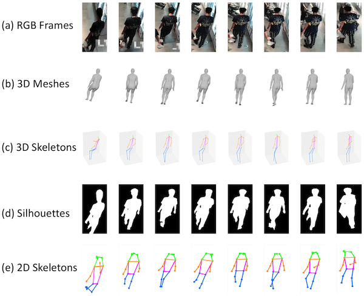

 

* Xinchen Liu (刘鑫辰)

* Email: or  *My previous email xinchenliu \[at\] bupt \[dot\] edu \[dot\] cn has been deprecated.

* Github: [lxc86739795](https://github.com/lxc86739795)

## About Me
I am currently a Senior Researcher leading the Fundamental Video Intelligence Lab at JD Explore Academy led by [Dr. Xiaodong He](https://scholar.google.com/citations?user=W5WbqgoAAAAJ&hl=en&oi=ao).
My research interests include multimedia computing, computer vision, generative models for visual content, and their applications in retail.
I was working closely with [Prof. Wu Liu](https://scholar.google.com/citations?user=rQpizr0AAAAJ&hl=en) and [Dr. Tao Mei](https://scholar.google.com/citations?user=7Yq4wf4AAAAJ&hl=en) in my early career.
I received my Ph. D. degree from the Beijing Key Lab of Intelligent Telecommunication Software and Multimedia, Beijing University of Posts and Telecommunications in 2018, under the supervision of [Prof. Huadong Ma](https://scholar.google.com/citations?user=A-vcjvUAAAAJ&hl=en).
I received my B.S. degree from Northwest A&F University in 2011.

**We are recruiting self-motivated interns in computer vision and multimedia. Please send your CV to my email if you are interested in the positions! :D**

---
## Recent News
- February, 2025, our team obtained the **2024 Chinese Association for Artificial Intelligence Wu Wenjun Artificial Intelligence Science and Technology Award, Special Prize for Technology Progress Award (中国人工智能学会吴文俊人工智能科技奖，科技进步特等奖)**. [Link](https://caai.cn/index.php?s=/home/article/detail/id/4486.html).
- January, 2025, we are organizing **The Special Session of Multi-modal Agents for Visual Analysis and Generation** in conjunction with IEEE ICIP. Paper submission due is **22 Jan 2024**. Welcome submissions! [Website](https://2025.ieeeicip.org/special-sessions/)
- July, 2024, we are organizing **The 5th International Workshop On Human-Centric Multimedia Analysis (HUMA)** in conjunction with ACM Multimedia 2024. Paper submission due is **31 July 2024**. Welcome submissions! [Website](https://hcma2024.github.io/). Two challenges,  [Multimodal Human Motion Capture](https://hcma2024.github.io/mhmc) and [Multimodal Gait Recognition](https://hcma2024.github.io/mgr), are also open for participation!
- July, 2024, **One paper** on gait recognition with multi-modal representations was accepted by **ACM Multimedia 2024**. Congratulations to our team and collaborators!
- March, 2024, **One paper** on action segmentation using IoT signals was accepted by **ACM ToMM** ([arXiv](https://arxiv.org/abs/2311.17428)). Congratulations to our collaborators!
- Febrary, 2024, **One paper** on efficient human NeRF was accepted by **CVPR 2024** ([arXiv](https://arxiv.org/abs/2312.02232)). Congratulations to our collaborators!
- October, 2023, we will host **The 4th International Workshop On Human-Centric Multimedia Analysis (HUMA)** in conjunction with ACM Multimedia 2023. **Workshop Date: 2, November, 2023** in Ottawa, Canada.
- September, 2023, our open-source toolbox **FastReID** ([GitHub](https://github.com/JDAI-CV/fast-reid)) was accepted by the open-source software competition session of **ACM Multimedia 2023**. Congratulations to our team and collaborators! FastReID is a PyTorch-based toolbox for general object re-identification with SOTA algorithms and models.
- August, 2023, **One paper** on gait recognition with a new dataset ([Project](https://gait3d.github.io/gait3d-parsing-hp/)) was accepted by **ACM Multimedia 2023**. Congratulations to our team and collaborators!
- June, 2023, we are organizing **The 4th International Workshop On Human-Centric Multimedia Analysis (HUMA)** in conjunction with ACM Multimedia 2023. Paper submission due is **31 July 2023**. Welcome submissions! [Website](https://hcma2023.github.io/)
- November, 2022, our paper "PROVID: Progressive and Multimodal Vehicle Reidentification for Large-Scale Urban Surveillance" was recognized as the **ESI Highly Cited Paper** (Top 1% of papers in the academic field).
- October, 2022, we are organizing a Special Issue of Human-centric Multimedia Analysis in the Journal of Multimedia Tools and Applications. Welcome submissions! **Submission deadline: March 13, 2023. Final notification date: August 2, 2023.** [CALL FOR PAPER](https://www.springer.com/journal/11042/updates/23635992?gclid=Cj0KCQjwwfiaBhC7ARIsAGvcPe5dF5DYQnBtXxEzHP9EzFqbR28eNOK2kPZdUuV5V4yj4CRBGW1Xp84aAtzCEALw_wcB)
- August, 2022, I gave the talk, "Gait Recognition from 2D to 3D", at [CCIG 2022 Young Scholar Panel](http://ccig.csig.org.cn/%e7%89%b9%e8%89%b2%e8%ae%ba%e5%9d%9b-2/) (2022中国图象图形学大会，青年学者论坛). Thanks for the invitation of the committee. The slides can be downloaded [here](./papers/CCIG2022_Gait3D_XinchenLiu.pdf).
- June, 2022, we are organizing **The 3rd International Workshop On Human-Centric Multimedia Analysis (HUMA)** in conjunction with ACM Multimedia 2022. Paper submission due is **17 July 2021**. Welcome submissions! [Website](https://hcma2022.github.io/)
- June, 2022, **four papers** was accepted by **ACM Multimedia 2022**. The papers and codes will be available soon. Congratulations to our team and collaborators!
- June, 2022, our paper, "Part-level Action Parsing via a Pose-guided Coarse-to-Fine Framework", on IEEE ISCAS 2022 was selected as **IEEE CAS MSA-TC Best Paper Award - Honorable Mention**. This is the second time our team has obtained this honor. Thanks to our collaborators!
- June, 2022, we are organizing **The 3rd International Workshop On Human-Centric Multimedia Analysis (HUMA)** with ACM Multimedia 2022. Paper submission due 10 August 2022. [Website](https://hcma2022.github.io/)
- March, 2022, the [Gait3D dataset](https://gait3d.github.io/) and the [code](https://github.com/Gait3D/Gait3D-Benchmark) in our CVPR 2022 paper are now released! Any research can obtain the dataset by signing an agreement.
- March, 2022, we are organizing **The 1st International Workshop on 3D Multimedia Analytics, Search and Generation (3DMM)** in conjunction with IEEE ICME 2022. Paper submission due is extended to **27 March 2022**. Welcome submissions! [Website](https://3dmm-icme2022.github.io/)
- March, 2022, one paper on **3D gait recognition and a new benchmark Gait3D** was accepted by **CVPR 2022**. Congrats to my intern Jinkai Zheng and thanks to our collaborators! The paper and the new dataset will be released soon.
- February, 2022, 40+ algorithms of CV, NLP, Supply Chain, etc. developed by our group and collaborators have been open-souced on OpenI（启智）. Welcome to use the codes at [JD on OpenI](https://git.openi.org.cn/JDOpenISCT).
- January, 2022, one paper on fine-grained action parsing was accepted as a lecture (oral) presentation by **IEEE ISCAS 2022**. Congratulations to my intern [Xiaodong Chen](https://scholar.google.com/citations?user=FZJ-fFYAAAAJ&hl=en) and thanks to our collaborators!
- November, 2021, I will serve as an Area Chair for [ICME 2022](http://2022.ieeeicme.org/).
- October, 2021, our team obtained the **2nd Award** in [ICCV21 DeeperAction Challenge Track 3 - Kinetics-TPS Challenge on Part-level Action Parsing](https://deeperaction.github.io/results/). Congratulations to our teammates [Xiaodong Chen](https://scholar.google.com/citations?user=FZJ-fFYAAAAJ&hl=en) and [Kun Liu](https://scholar.google.com/citations?user=NMMB7wcAAAAJ&hl=en&oi=ao)! The technical report of our solution can be found [HERE](https://arxiv.org/abs/2110.03368).
- September, 2021, **The 2nd International Workshop On Human-Centric Multimedia Analysis (HUMA)** will be held on 20 October 2021 in conjunction with ACM Multimedia 2021. This year we have three invited talks and five paper presentations. More details can be found on the [Website](https://hcma2021.github.io/).
- August, 2021, we are organizing **The 2nd International Workshop On Human-Centric Multimedia Analysis (HUMA)** in conjunction with ACM Multimedia 2021. Paper submission due is extended to **17 August 2021**. Welcome submissions! [Website](https://hcma2021.github.io/)
- July, 2021, one paper on Explanable Person ReID was accepted by **ICCV 2021**. Congrats to my intern [Xiaodong Chen](https://scholar.google.com/citations?user=FZJ-fFYAAAAJ&hl=en).
- May, 2021, our paper on IEEE ISCAS 2021 was selected as MSA-TC "**Best Paper Award - Honorable Mention**". Thanks to our collaborators!
- May, 2021, our team are organizing **ACM Multimedia Asia 2021**. Paper submission due: 19 July 2021. [Website](https://mmasia2021.uqcloud.net/)
- April, 2021, we are organizing **The 2nd International Workshop On Human-Centric Multimedia Analysis (HUMA)** with ACM Multimedia 2021. Paper submission due: 10 August 2021. [Website](https://hcma2021.github.io/)
- January, 2021, one paper on gait recognition was accepted as a lecture (oral) presentation by **IEEE ISCAS 2021**. Congratulations to Jinkai Zheng and thanks to our collaborators!
- December, 2020, our team won the **Championship** in [NAIC Challenge 2020 AI+Person ReID Track](https://mp.weixin.qq.com/s/iktrS9If12uum0_qQ1MZ1A). Congratulations to our teammates [Xingyu Liao](https://github.com/L1aoXingyu), [Lingxiao He](https://lingxiao-he.github.io/), [Peng Cheng](https://github.com/CPFLAME), and [Guanan Wang](https://wangguanan.github.io/)!
- November, 2020, the codebase for **human parsing and vehicle parsing** in our papers of ACM MM'19 and ACM MM'20, has been released, please refer to [CODE](
https://github.com/lxc86739795/human_vehicle_parsing_platform). It supported multiple segmentation and parsing methods and two datasets ([LIP](http://sysu-hcp.net/lip/) for humans, [MVP](MVP.html) for vehicles).
- November, 2020, the code for the paper, "**Beyond the Parts: Learning Multi-view Cross-part Correlation for Vehicle Re-identification**, ACM MM, 2020", has been released, please refer to [CODE](https://github.com/lxc86739795/vehicle_reid_by_parsing).
- August, 2020, one regular paper and one demo paper are accepted by **ACM Multimedia, 2020**.
- July, 2020, we released a large-scale multi-grained vehicle parsing dataset, **MVP dataset**, for vehicle part segmentation. For more details, please refer to [MVP](MVP.md).
- July, 2020, one paper was published on **IEEE Transactions on Image Processing** [LINK](https://ieeexplore.ieee.org/document/9127791).
- June, 2020, our team presented **FastReID**, a powerful toolbox of object re-identification for academia and industry. It achieves state-of-the-art performance for both person Re-Id and vehicle Re-Id. Please refer to our [PAPER](https://arxiv.org/abs/2006.02631) and [CODE](https://github.com/JDAI-CV/fast-reid) for more details.
- December, 2019, we made a performance list of recent vehicle Re-Id methods on the VeRi dataset. We also apply a strong baseline model for Re-Id on six vehicle Re-Id datasets. Please refer to [LINK](https://github.com/JDAI-CV/VeRidataset) and the strong baseline model [CODE](https://github.com/JDAI-CV/fast-reid).
- November, 2019, my Ph. D. Thesis, "_Research on Key Techniques of Vehicle Search in Urban Video Surveillance Networks_", was awarded the Outstanding Doctoral Dissertation Award of China Society of Image and Graphics (**中国图象图形学学会优秀博士学位论文**). [NEWS](http://www.csig.org.cn/detail/2880) [PDF](./papers/thesis_lxc.pdf)
- October 22, 2019, one paper (Paper ID: P1C-10) will be presented at **ACM Multimedia 2019**, Nice, France.
- July, 2019, our paper, "_PROVID: Progressive and Multimodal Vehicle Reidentification for Large-Scale Urban Surveillance_" on IEEE Trans. Multimedia 20(3): 645-658, (2018), was awarded the **TMM Multimedia Prize Paper Award 2019**. Thanks to Dr. Wu Liu, Dr. Tao Mei, and Prof. Huadong Ma!
- July, 2019, one paper was presented at **ICME 2019**, Shanghai, China.
- June, 2019, one paper was presented at **CVPR 2019**, Long Beach, USA.

---
## Publications ([dblp](https://dblp.uni-trier.de/pers/hd/l/Liu:Xinchen) [Google Scholar](https://scholar.google.com/citations?user=31Dv7M0AAAAJ&hl=en))

### 2024
- Jinkai Zheng, **Xinchen Liu**, Boyue Zhang, Chenggang Yan, Jiyong Zhang, Wu Liu, Yongdong Zhang:
_It Takes Two: Accurate Gait Recognition in the Wild via Cross-granularity Alignment_. ACM Multimedia 2024, 8786-8794. [ARXIV](https://arxiv.org/abs/2411.10742)

- Xiaodong Chen, Kunlang He, Wu Liu, **Xinchen Liu**, Zheng-Jun Zha, Tao Mei:
_CLaM: An Open-Source Library for Performance Evaluation of Text-driven Human Motion Generation_. ACM Multimedia 2024, 11194-11197. [Paper](https://dl.acm.org/doi/abs/10.1145/3664647.3685523)

- Hengyuan Liu, Xiaodong Chen, Xinchen Liu, Xiaoyan Gu, Wu Liu:
_AnimateAnywhere: Context-Controllable Human Video Generation with ID-Consistent One-shot Learning_, ACM Multimedia 2024 HCMA Workshop. [Paper](https://dl.acm.org/doi/abs/10.1145/3688865.3689477)

- Caoyuan Ma, Yu-Lun Liu, Zhixiang Wang, Wu Liu, **Xinchen Liu**, Zheng Wang:
_HumanNeRF-SE: A Simple yet Effective Approach to Animate HumanNeRF with Diverse Poses_. CVPR 2024. [Paper](https://openaccess.thecvf.com/content/CVPR2024/html/Ma_HumanNeRF-SE_A_Simple_yet_Effective_Approach_to_Animate_HumanNeRF_with_CVPR_2024_paper.html)

- Qi Liu, **Xinchen Liu**, Kun Liu, Xiaoyan Gu, Wu Liu:
_SigFormer: Sparse Signal-Guided Transformer for Multi-Modal Human Action Segmentation_. ACM ToMM 2024. [Paper](https://dl.acm.org/doi/10.1145/3657296)

### 2023 
- Jinkai Zheng, **Xinchen Liu**, Shuai Wang, Lihao Wang, Chenggang Yan, Wu Liu:
_Parsing is All You Need for Accurate Gait Recognition in the Wild_. ACM Multimedia 2023, 116-124. (**Oral Presentation**) [PROJECT](https://gait3d.github.io/gait3d-parsing-hp/) [ARXIV](https://arxiv.org/abs/2308.16739)

- Lingxiao He, Xingyu Liao, Wu Liu, **Xinchen Liu**, Peng Cheng, Tao Mei:
_FastReID: A Pytorch Toolbox for General Instance Re-identification_. ACM Multimedia 2023, 9664-9667. [GitHub](https://github.com/JDAI-CV/fast-reid) [ARXIV](https://arxiv.org/abs/2006.02631)

- Jingkuan Song, Wu Liu, **Xinchen Liu**, Dingwen Zhang, Chaowei Fang, Hongyuan Zhu, Wenbing Huang, John Smith, Xin Wang
_HCMA'23: 4th International Workshop on Human-Centric Multimedia Analysis. ACM Multimedia 2023, 9734-9735.

### 2022
- Guang Yang, Wu Liu, **Xinchen Liu**, Xiaoyan Gu, Juan Cao, Jintao Li:
_Delving into the Frequency: Temporally Consistent Human Motion Transfer in the Fourier Space_. ACM Multimedia 2022, 1156-1166.

- Xiaodong Chen, Wu Liu, **Xinchen Liu**, Yongdong Zhang, Jungong Han, Tao Mei:
_MAPLE: Masked Pseudo-Labeling autoEncoder for Semi-supervised Point Cloud Action Recognition_. ACM Multimedia 2022, 708-718. (**Oral Presentation**)

- Quanwei Yang, **Xinchen Liu**, Wu Liu, Hongtao Xie, Xiaoyan Gu, Lingyun Yu, Yongdong Zhang:
_REMOT: A Region-to-Whole Framework for Realistic Human Motion Transfer_. ACM Multimedia 2022, 1128-1137.

- Jinkai Zheng, **Xinchen Liu**, Xiaoyan Gu, Yaoqi Sun, Chuang Gan, Jiyong Zhang, Wu Liu, Chenggang Yan:
_Gait Recognition in the Wild with Multi-hop Temporal Switch_. ACM Multimedia 2022, 6136-6145 [ARXIV](https://arxiv.org/abs/2209.00355)

- Xiaodong Chen, **Xinchen Liu**, Kun Liu, Wu Liu, Dong Wu, Yongdong Zhang, Tao Mei:
_Part-level Action Parsing via a Pose-guided Coarse-to-Fine Framework_. ISCAS 2022, 419-423 (**Lecture Presentation**) [PAPER](https://arxiv.org/abs/2203.04476) (**IEEE CAS MSA-TC 2022 Best Paper Award Honorable Mention**)

- Jinkai Zheng, **Xinchen Liu**, Wu Liu, Lingxiao He, Chenggang Yan, Tao Mei:
_Gait Recognition in the Wild with Dense 3D Representations and A Benchmark_. CVPR 2022, 20228-20237. [PROJECT](https://gait3d.github.io/) [CODE](https://github.com/Gait3D/Gait3D-Benchmark) [ARXIV](https://arxiv.org/abs/2204.02569)

### 2021
- Wu Liu, **Xinchen Liu**, Jingkuan Song, Dingwen Zhang, Wenbing Huang, Junbo Guo, John Smith:
_HUMA'21: 2nd International Workshop on Human-centric Multimedia Analysis_. ACM Multimedia 2021: 5690-5691
- Xiaodong Chen, **Xinchen Liu**, Kun Liu, Wu Liu, Tao Mei:
_A Baseline Framework for Part-level Action Parsing and Action Recognition_. CoRR abs/2110.03368 (2021) [arXiv](https://arxiv.org/abs/2110.03368) (**2nd place solution to Kinetics-TPS Track on Part-level Action Parsing in ICCV DeeperAction Challenge 2021**)
- Xiaodong Chen, **Xinchen Liu**, Wu Liu, Yongdong Zhang, Xiao-Ping Zhang, Tao Mei:
_Explainable Person Re-Identification with Attribute-guided Metric Distillation_. ICCV 2021 [PAPER](https://openaccess.thecvf.com/content/ICCV2021/html/Chen_Explainable_Person_Re-Identification_With_Attribute-Guided_Metric_Distillation_ICCV_2021_paper.html) [PDF](./papers/2021_ICCV_AMD.pdf)
- Jinkai Zheng, **Xinchen Liu**, Chenggang Yan, Jiyong Zhang, Wu Liu, Xiaoping Zhang, Tao Mei:
_TraND: Transferable Neighborhood Discovery for Unsupervised Cross-domain Gait Recognition_. ISCAS 2021 [PAPER](https://ieeexplore.ieee.org/document/9401218) [PDF](./papers/2021_ISCAS_TraND.pdf) [CODE](https://github.com/JinkaiZheng/TraND) (**IEEE CAS MSA-TC 2021 Best Paper Award Honorable Mention**)

### 2020

- **Xinchen Liu**, Wu Liu, Jinkai Zheng, Chenggang Yan, Tao Mei:
_Beyond the Parts: Learning Multi-view Cross-part Correlation for Vehicle Re-identification_. ACM MM 2020: 907-915 [PDF](./papers/2020_ACMMM_PCRNet.pdf) [CODE](https://github.com/lxc86739795/vehicle_reid_by_parsing)

- Xiaodong Chen, Wu Liu, **Xinchen Liu**, Yongdong Zhang, Tao Mei:
_A Cross-modality and Progressive Person Search System_. ACM MM Demo 2020: 4550-4552 [PDF](./papers/2020_ACMMM_CPPS.pdf)

- Lingxiao He, Xingyu Liao, Wu Liu, **Xinchen Liu**, Peng Cheng, Tao Mei:
_FastReID: A Pytorch Toolbox for General Instance Re-identification_. CoRR abs/2006.02631 (2020) [ARXIV](https://arxiv.org/abs/2006.02631)

- Qi Wang, **Xinchen Liu**, Wu Liu, Anan Liu, Wenyin Liu, Tao Mei:
_MetaSearch: Incremental Product Search via Deep Meta-learning_. IEEE Trans. Image Process. 29: 7549-7564 (2020) [LINK](https://ieeexplore.ieee.org/document/9127791)

### 2019

- **Xinchen Liu**, Meng Zhang, Wu Liu, Jingkuan Song, Tao Mei:
_BraidNet: Braiding Semantics and Details for Accurate Human Parsing_. ACM MM 2019: 338-346 [PDF](./papers/2019_ACMMM_BraidNet.pdf)

- **Xinchen Liu**, Wu Liu, Meng Zhang, Jingwen Chen, Lianli Gao, Chenggang Yan, Tao Mei:
_Social Relation Recognition from Videos via Multi-scale Spatial-Temporal Reasoning_. CVPR 2019: 3566-3574 [PDF](./papers/2019_CVPR_ViSR.pdf) [CODE](https://github.com/mxtx0509/MSRT)

- **Xinchen Liu**, Wu Liu, Huadong Ma, Shuangqun Li:
_PVSS: A Progressive Vehicle Search System for Video Surveillance Networks_. J. Comput. Sci. Technol. 34(3): 634-644 (2019) [PDF](./papers/2019_JCST_PVSS.pdf)

- Meng Zhang, **Xinchen Liu**, Wu Liu, Anfu Zhou, Huadong Ma, Tao Mei:
_Multi-Granularity Reasoning for Social Relation Recognition from Images_. ICME 2019: 1618-1623 [PDF](./papers/2019_ICME_MGR.pdf) [CODE](https://github.com/mxtx0509/MGR)

### 2018

- **Xinchen Liu**, Wu Liu, Tao Mei, Huadong Ma:
_PROVID: Progressive and Multimodal Vehicle Reidentification for Large-Scale Urban Surveillance_. IEEE Trans. Multimedia 20(3): 645-658, (2018) (**TMM Multimedia Prize Paper Award 2019**) [PDF](./papers/2018_TMM_PROVID.pdf)

- **Xinchen Liu**, Wu Liu, Huadong Ma, Shuangqun Li:
_A Progressive Vehicle Search System for Video Surveillance Networks_. BigMM 2018: 1-7

- Wenhui Gao, **Xinchen Liu**, Huadong Ma, Yanan Li, Liang Liu:
_MMH: Multi-Modal Hash for Instant Mobile Video Search_. MIPR 2018: 57-62

### 2017

- Wu Liu, **Xinchen Liu**, Huadong Ma, Peng Cheng:
_Beyond Human-level License Plate Super-resolution with Progressive Vehicle Search and Domain Priori GAN_. ACM Multimedia 2017: 1618-1626 [PDF](./papers/2017_ACMMM_DPGAN.pdf)

### 2016

- Shuangqun Li, **Xinchen Liu**, Wu Liu, Huadong Ma, Haitao Zhang:
_A discriminative null space based deep learning approach for person re-identification_. CCIS 2016: 480-484

- **Xinchen Liu**, Wu Liu, Tao Mei, Huadong Ma:
_A Deep Learning-Based Approach to Progressive Vehicle Re-identification for Urban Surveillance_. ECCV (2) 2016: 869-884 [PDF](./papers/2016_ECCV_PVID.pdf)

- **Xinchen Liu**, Wu Liu, Huadong Ma, Huiyuan Fu:
_Large-scale vehicle re-identification in urban surveillance videos_. ICME 2016: 1-6 (**Best Student Paper Award**) [PDF](./papers/2016_ICME_VeRi.pdf)

### Before 2015

- **Xinchen Liu**, Huadong Ma, Huiyuan Fu, Mo Zhou:
_Vehicle Retrieval and Trajectory Inference in Urban Traffic Surveillance Scene_. ICDSC 2014: 26:1-26:6

---
## Talks
December, 2024, China Conference on Artificial Intelligence (2024中国人工智能大会), 自然语言处理专题论坛, "人工智能基础模型走向多模态与产业落地" (In Chinese).

December, 2023, The 19th Young Scientists Conference of the Chinese Society of Image and Graphics (第19届中国图象图形学学会青年科学家会议), 优博论坛, "大规模自然场景步态识别初探" (In Chinese).

August, 2022, CCIG 2022 Young Scholar Panel (2022中国图象图形学大会，青年学者论坛), "Gait Recognition from 2D to 3D". [SLIDES](./papers/CCIG2022_Gait3D_XinchenLiu.pdf)

June, 2020, NCIG 2020 Outstanding Doctor and Young Scholar Panel (2020全国图象图形学学术会议，优秀博士与青年学者论坛), "Large-scale Vehicle Search in Smart City (智慧城市中的车辆搜索)" (In Chinese). [SLIDES](./papers/NCIG2020_VehicleReID_XinchenLiu.pdf)

---
## Activities
Area Chair, ICME 2022/2024

Local Session Chair, ACM Multimedia 2021

Proceedings Co-Chair, ACM Multimedia Asia 2021

Co-chair, HUMA Workshop at ACM Multimedia 2020~2024

Journal Reviewer: IEEE TPAMI, IEEE TMM, IEEE TIP, IEEE TCSVT, IEEE TITS, IEEE TMC, ACM TOMM, ACM TIST, IoTJ, etc.

Conference Reviewer: CVPR, ACM MM, ICCV, ECCV, SIGIR, AAAI, ICME, ICASSP, ICIP, etc.

Membership: CCF/CSIG Senior Member, IEEE/ACM Member.

---
## Awards and Honors
Chinese Association for Artificial Intelligence Wu Wenjun Artificial Intelligence Science and Technology Award, 2024, Special Prize for Technology Progress Award (2024年度中国人工智能学会吴文俊人工智能科技奖，科技进步特等奖 (3/15) )

ChinaMM Multimedia Industrial Innovative Technology Award, 2023, for the project "_Key Technology on Multi-modal Human Analysis_"

IEEE CAS MSA-TC Best Paper Award - Honorable Mention, 2022, for the paper "_Part-level Action Parsing via a Pose-guided Coarse-to-Fine Framework_"

ICCV 2021 DeeperAction Challenge, Track 3 Kinetics-TPS Challenge on Part-level Action Parsing, 2nd Award

IEEE CAS MSA-TC Best Paper Award - Honorable Mention, 2021, for the paper "_TraND: Transferable Neighborhood Discovery for Unsupervised Cross-domain Gait Recognition_"

Outstanding Doctoral Dissertation Award of China Society of Image and Graphics, 2019, for my Ph. D. thesis "_Research on Key Techniques of Vehicle Search in Urban Video Surveillance Networks_"

IEEE TMM Multimedia Prize Paper Award, 2019, for the paper "_PROVID: Progressive and Multimodal Vehicle Reidentification for Large-Scale Urban Surveillance_"

ICME 2019, 2021, Outstanding Reviewer Award

CVPR 2019 LIP Challenge, Track 3 Multi-Person Human Parsing, 2nd Award

CVPR 2018 LIP Challenge, Track 1 Single-Person Human Parsing, 2nd Award

IEEE ICME Best Student Paper Award, 2016, for the paper "_Large-scale vehicle re-identification in urban surveillance videos_"

---
## Research

### Gait Recognition in the Wild with dense 3D Representations ([More Details](https://gait3d.github.io/))
Existing studies for gait recognition are dominated by 2D representations like the silhouette or skeleton of the human body in constrained scenes. However, humans live and walk in unconstrained 3D space, so projecting the 3D human body onto the 2D plane will discard a lot of crucial information like the viewpoint, shape, and dynamics for gait recognition. Therefore, this paper aims to explore dense 3D representations for gait recognition in the wild, which is a practical yet neglected problem. In particular, we propose a novel framework to explore the 3D Skinned Multi-Person Linear (SMPL) model of the human body for gait recognition, named SMPLGait. Our framework has two elaborately designed branches of which one extracts appearance features from silhouettes, the other learns knowledge of 3D viewpoints and shapes from the 3D SMPL model. With the learned 3D knowledge, the appearance features from arbitrary viewpoints can be normalized in the latent space to overcome the extreme viewpoint changes in the wild scenes. In addition, due to the lack of suitable datasets, we build the first large-scale 3D representation-based gait recognition dataset, named Gait3D. It contains 4,000 subjects and over 25,000 sequences extracted from 39 cameras in an unconstrained indoor scene. More importantly, it provides 3D SMPL models recovered from video frames which can provide dense 3D information of body shape, viewpoint, and dynamics. Furthermore, it also provides 2D silhouettes and keypoints that can be explored for gait recognition using multi-modal data. Based on Gait3D, we comprehensively compare our method with existing gait recognition approaches, which reflects the superior performance of our framework and the potential of 3D representations for gait recognition in the wild.

&ensp;&ensp;&ensp;&ensp;

### Progressive Vehicle Search in Larve-scale Surveillance Networks ([More Details](http://vehiclereid.github.io/VeRi/))
Compared with person re-identification, which has concentrated attention, vehicle re-identification is an important yet frontier problem in video surveillance and has been neglected by the multimedia and vision communities. 
Since most existing approaches mainly consider the general vehicle appearance for re-identification while overlooking the distinct vehicle identifier, such as the license number plate, they attain suboptimal performance. 
In this work, we propose PROVID, a PROgressive Vehicle re-IDentification framework based on deep neural networks. 
In particular, our framework not only utilizes the multi-modality data in large-scale video surveillance, such as visual features, license plates, camera locations, and contextual information, but also considers vehicle re-identification in two progressive procedures: coarse-to-fine search in the feature domain, and near-to-distant search in the physical space. 
Furthermore, to evaluate our progressive search framework and facilitate related research, we construct the VeRi dataset, which is the most comprehensive dataset from real-world surveillance videos. 
It not only provides large numbers of vehicles with varied labels and sufficient cross-camera recurrences but also contains license number plates and contextual information. 
Extensive experiments on the VeRi dataset demonstrate both the accuracy and efficiency of our progressive vehicle re-identification framework.

&ensp;&ensp;&ensp;&ensp;&ensp;&ensp;

---
### Multi-grained Vehicle Parsing from Images([More Details](./MVP.md))
We present a novel large-scale dataset, Multi-grained Vehicle Parsing (MVP), for semantic analysis of vehicles in the wild, which has several featured properties.
First of all, the MVP contains 24,000 vehicle images captured in read-world surveillance scenes, which makes it more scalable than existing datasets.
Moreover, for different requirements, we annotate the vehicle images with pixel-level part masks in two granularities, i.e., the coarse annotations of ten classes and the fine annotations of 59 classes.
The former can be applied to object-level applications such as vehicle Re-Id, fine-grained classification, and pose estimation, while the latter can be explored for high-quality image generation and content manipulation.
Furthermore, the images reflect the complexity of real surveillance scenes, such as different viewpoints, illumination conditions, backgrounds, etc.
In addition, the vehicles have diverse countries, types, brands, models, and colors, which makes the dataset more diverse and challenging.
A codebase for person and vehicle parsing can be found [HERE](https://github.com/lxc86739795/human_vehicle_parsing_platform).

---
### Fine-grained Human Parsing in Images
This paper focuses on fine-grained human parsing in images. 
This is a very challenging task due to the diverse person's appearance, semantic ambiguity of different body parts and clothing, and extremely small parsing targets. 
Although existing approaches can achieve significant improvement through pyramid feature learning, multi-level supervision, and joint learning with pose estimation, human parsing is still far from being solved. 
Different from existing approaches, we propose a Braiding Network, named BraidNet, to learn complementary semantics and details for fine-grained human parsing. 
The BraidNet contains a two-stream braid-like architecture.
The first stream is a semantic abstracting net with a deep yet narrow structure which can learn semantic knowledge by a hierarchy of fully convolution layers to overcome the challenges of diverse person appearance. 
To capture low-level details of small targets, the detail-preserving net is designed to exploit a shallow yet wide network without down-sampling, which can retain sufficient local structures for small objects. 
Moreover, we design a group of braiding modules across the two sub-nets, by which complementary information can be exchanged during end-to-end training. 
Besides, at the end of BraidNet, a Pairwise Hard Region Embedding strategy is proposed to eliminate the semantic ambiguity of different body parts and clothing. 
Extensive experiments show that the proposed BraidNet achieves better performance than the state-of-the-art methods for fine-grained human parsing.

Try Human Parsing Online API at [JD Neuhub](http://neuhub.jd.com/ai/api/image/humanParsing).

---
### Social Relation Recognition in Videos
Discovering social relations, e.g., kinship, friendship, etc., from visual content can make machines better interpret the behaviors and emotions of human beings. 
Existing studies mainly focus on recognizing social relations from still images while neglecting another important media—video. 
On the one hand, the actions and storylines in videos provide more important cues for social relation recognition. 
On the other hand, the key persons may appear at arbitrary spatial-temporal locations, even not in the same image from beginning to end. 
To overcome these challenges, we propose a Multi-scale Spatial-Temporal Reasoning (MSTR) framework to recognize social relations from
videos. 
For the spatial representation, we not only adopt a temporal segment network to learn global action and scene information but also design a Triple Graphs model to capture visual relations between persons and objects. 
For the temporal domain, we propose a Pyramid Graph Convolutional Network to perform temporal reasoning with multi-scale receptive fields, which can obtain both long-term and short-term storylines in videos. 
By this means, MSTR can comprehensively explore the multi-scale actions and storylines in spatial-temporal dimensions for social relation reasoning in videos. 
Extensive experiments on a new large-scale Video Social Relation dataset demonstrate the effectiveness of the proposed framework.
The dataset can be downloaded from [BaiduPan (~57GB, download code: jzei)](https://pan.baidu.com/s/1zeH2qeZZVRu__Kg-M5hJuw).

---

_Last Update: **February, 2025**_
