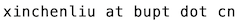
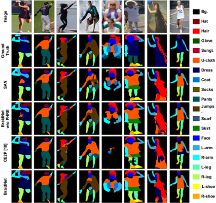
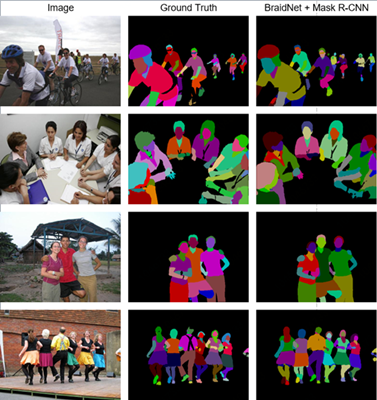
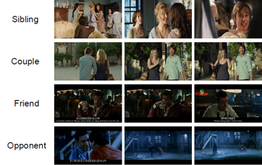

 

* Xinchen Liu (刘鑫辰)

* Email:  or 

* Github: [lxc86739795](https://github.com/lxc86739795)

## About Me
I am currently a Senior Researcher at Computer Vision and Multimedia Lab of JD AI Research working with Dr. [Wu Liu](https://liuwu.weebly.com/) and Dr. [Tao Mei](https://taomei.me/).
I received the Ph. D. degree in computer science in Beijing Key Lab of Intelligent Telecommunication Software and Multimedia, Beijing University of Posts and Telecommunications, in June 2018. 
My supervisor is Prof. [Huadong Ma](https://scs.bupt.edu.cn/info/1009/2214.htm). 
My research interests include multimedia computing, computer vision, and their applications in retail.

**We are recruiting self-motivated interns in computer vision, deep learning, and multimedia.
Please directly send your CV to my email if you are interested in the positions! :D**

---
## Recent News
- August, 2021, we are organizing **The 2nd International Workshop On Human-Centric Multimedia Analysis (HUMA)** in conjunction with ACM Multimedia 2021. Paper submission due is extended to **17 August 2021**. Welcome submissions! [Website](https://hcma2021.github.io/)
- July, 2021, one paper on Explanable Person ReID was accepted by **ICCV 2021**.
- May, 2021, our paper on IEEE ISCAS 2021 was selected as MSA-TC "**Best Paper Award - Honorable Mention**". Thanks to our collaborators!
- May, 2021, our team are organizing **ACM Multimedia Asia 2021**. Paper submission due: 19 July 2021. [Website](https://mmasia2021.uqcloud.net/)
- April, 2021, we are organizing **The 2nd International Workshop On Human-Centric Multimedia Analysis (HUMA)** with ACM Multimedia 2021. Paper submission due: 10 August 2021. [Website](https://hcma2021.github.io/)
- January, 2021, one paper on gait recognition was accepted as a lecture (oral) presentation by **IEEE ISCAS 2021**. Congratulations to Jinkai Zheng and thanks to our collaborators!
- December, 2020, our team won the **Championship** in [NAIC Challenge 2020 AI+Person ReID Track](https://mp.weixin.qq.com/s/iktrS9If12uum0_qQ1MZ1A). Congratulations to our teammates [Xingyu Liao](https://github.com/L1aoXingyu), [Lingxiao He](https://lingxiao-he.github.io/), [Peng Cheng](https://github.com/CPFLAME), and [Guanan Wang](https://wangguanan.github.io/)!
- November, 2020, the codebase for **human parsing and vehicle parsing** in our papers of ACM MM'19 and ACM MM'20, has been released, please refer to [CODE](
https://github.com/lxc86739795/human_vehicle_parsing_platform). It supported multiple segmentation and parsing methods and two datasets ([LIP](http://sysu-hcp.net/lip/) for human, [MVP](MVP.html) for vehicle).
- November, 2020, the code for the paper, "**Beyond the Parts: Learning Multi-view Cross-part Correlation for Vehicle Re-identification**, ACM MM, 2020", has been released, please refer to [CODE](https://github.com/lxc86739795/vehicle_reid_by_parsing).
- August, 2020, one regular paper and one demo paper are accpepted by **ACM Multimedia, 2020**.
- July, 2020, we released a large-scale multi-grained vehicle parsing dataset, **MVP dataset**, for vehicle part segmentation. For more datails, please refer to [MVP](MVP.md).
- July, 2020, one paper was published on **IEEE Transactions on Image Processing** [LINK](https://ieeexplore.ieee.org/document/9127791).
- June, 2020, our team presented **FastReID**, a powerful toolbox of object re-identification for academia and industry. It achieves the state-of-the-art performance for both person Re-Id and vehicle Re-Id. Please refer to our [PAPER](https://arxiv.org/abs/2006.02631) and [CODE](https://github.com/JDAI-CV/fast-reid) for more details.
- December, 2019, we made a perfromance list of recent vehicle Re-Id methods on the VeRi dataset. We also apply a strong baseline model for Re-Id on six vehicle Re-Id datasets. Please refer to [LINK](https://github.com/JDAI-CV/VeRidataset) and the strong baseline model [CODE](https://github.com/JDAI-CV/fast-reid).
- November, 2019, my Ph. D. Thesis, "_Research on Key Techniques of Vehicle Search in Urban Video Surveillance Networks_", was awarded as the Outstanding Doctoral Dissertation Award of China Society of Image and Graphics (**中国图象图形学学会优秀博士学位论文**). [NEWS](http://www.csig.org.cn/detail/2880) [PDF](./papers/thesis_lxc.pdf)
- October 22, 2019, one paper (Paper ID: P1C-10) will be presented at **ACM Multimedia 2019**, Nice, France.
- July, 2019, our paper, "_PROVID: Progressive and Multimodal Vehicle Reidentification for Large-Scale Urban Surveillance_" on IEEE Trans. Multimedia 20(3): 645-658, (2018), was awarded the **TMM Multimedia Prize Paper Award 2019**. Thanks to Dr. Wu Liu, Dr. Tao Mei, and Prof. Huadong Ma!
- July, 2019, one paper was presented at **ICME 2019**, Shanghai, China.
- June, 2019, one paper was presented at **CVPR 2019**, Long Beach, USA.

---
## Publications ([dblp](https://dblp.uni-trier.de/pers/hd/l/Liu:Xinchen) [Google Scholar](https://scholar.google.com/citations?user=31Dv7M0AAAAJ&hl=en))

### 2021
- Xiaodong Chen, **Xinchen Liu**, Wu Liu, Yongdong Zhang, Xiao-Ping Zhang, Tao Mei:
_Explainable Person Re-Identification with Attribute-guided Metric Distillation_. ICCV 2021
- Jinkai Zheng, **Xinchen Liu**, Chenggang Yan, Jiyong Zhang, Wu Liu, Xiaoping Zhang, Tao Mei:
_TraND: Transferable Neighborhood Discovery for Unsupervised Cross-domain Gait Recognition_. ISCAS 2021 [arXiv](https://arxiv.org/abs/2102.04621) [CODE](https://github.com/JinkaiZheng/TraND)

### 2020

- **Xinchen Liu**, Wu Liu, Jinkai Zheng, Chenggang Yan, Tao Mei:
_Beyond the Parts: Learning Multi-view Cross-part Correlation for Vehicle Re-identification_. ACM MM 2020: 907-915 [PDF](./papers/2020_ACMMM_PCRNet.pdf) [CODE](https://github.com/lxc86739795/vehicle_reid_by_parsing)

- Xiaodong Chen, Wu Liu, **Xinchen Liu**, Yongdong Zhang, Tao Mei:
_A Cross-modality and Progressive Person Search System_. ACM MM Demo 2020: 4550-4552 [PDF](./papers/2020_ACMMM_CPPS.pdf)

- Lingxiao He, Xingyu Liao, Wu Liu, **Xinchen Liu**, Peng Cheng, Tao Mei:
_FastReID: A Pytorch Toolbox for General Instance Re-identification_. CoRR abs/2006.02631 (2020) [ARXIV](https://arxiv.org/abs/2006.02631)

- Qi Wang, **Xinchen Liu**, Wu Liu, Anan Liu, Wenyin Liu, Tao Mei:
_MetaSearch: Incremental Product Search via Deep Meta-learning_. IEEE Trans. Image Process. 29: 7549-7564 (2020) [LINK](https://ieeexplore.ieee.org/document/9127791)

### 2019

- **Xinchen Liu**, Meng Zhang, Wu Liu, Jingkuan Song, Tao Mei:
_BraidNet: Braiding Semantics and Details for Accurate Human Parsing_. ACM MM 2019: 338-346 [PDF](./papers/2019_ACMMM_BraidNet.pdf)

- **Xinchen Liu**, Wu Liu, Meng Zhang, Jingwen Chen, Lianli Gao, Chenggang Yan, Tao Mei:
_Social Relation Recognition from Videos via Multi-scale Spatial-Temporal Reasoning_. CVPR 2019: 3566-3574 [PDF](./papers/2019_CVPR_ViSR.pdf)

- **Xinchen Liu**, Wu Liu, Huadong Ma, Shuangqun Li:
_PVSS: A Progressive Vehicle Search System for Video Surveillance Networks_. J. Comput. Sci. Technol. 34(3): 634-644 (2019) [PDF](./papers/2019_JCST_PVSS.pdf)

- Meng Zhang, **Xinchen Liu**, Wu Liu, Anfu Zhou, Huadong Ma, Tao Mei:
_Multi-Granularity Reasoning for Social Relation Recognition from Images_. ICME 2019: 1618-1623 [PDF](./papers/2019_ICME_MGR.pdf)

### 2018

- **Xinchen Liu**, Wu Liu, Tao Mei, Huadong Ma:
_PROVID: Progressive and Multimodal Vehicle Reidentification for Large-Scale Urban Surveillance_. IEEE Trans. Multimedia 20(3): 645-658, (2018) (**TMM Multimedia Prize Paper Award 2019**) [PDF](./papers/2018_TMM_PROVID.pdf)

- **Xinchen Liu**, Wu Liu, Huadong Ma, Shuangqun Li:
_A Progressive Vehicle Search System for Video Surveillance Networks_. BigMM 2018: 1-7

- Wenhui Gao, **Xinchen Liu**, Huadong Ma, Yanan Li, Liang Liu:
_MMH: Multi-Modal Hash for Instant Mobile Video Search_. MIPR 2018: 57-62

### 2017

- Wu Liu, **Xinchen Liu**, Huadong Ma, Peng Cheng:
_Beyond Human-level License Plate Super-resolution with Progressive Vehicle Search and Domain Priori GAN_. ACM Multimedia 2017: 1618-1626 [PDF](./papers/2017_ACMMM_DPGAN.pdf)

### 2016

- Shuangqun Li, **Xinchen Liu**, Wu Liu, Huadong Ma, Haitao Zhang:
_A discriminative null space based deep learning approach for person re-identification_. CCIS 2016: 480-484

- **Xinchen Liu**, Wu Liu, Tao Mei, Huadong Ma:
_A Deep Learning-Based Approach to Progressive Vehicle Re-identification for Urban Surveillance_. ECCV (2) 2016: 869-884 [PDF](./papers/2016_ECCV_PVID.pdf)

- **Xinchen Liu**, Wu Liu, Huadong Ma, Huiyuan Fu:
_Large-scale vehicle re-identification in urban surveillance videos_. ICME 2016: 1-6 (**Best Student Paper Award**) [PDF](./papers/2016_ICME_VeRi.pdf)

### Before 2015

- **Xinchen Liu**, Huadong Ma, Huiyuan Fu, Mo Zhou:
_Vehicle Retrieval and Trajectory Inference in Urban Traffic Surveillance Scene_. ICDSC 2014: 26:1-26:6

---
## Talks
June, 2020, NCIG2020 Outstanding Doctor and Young Scholor Panel (2020全国图象图形学学术会议，优秀博士与青年学者论坛), "Large-scale Vehicle Search in Smart City (智慧城市中的车辆搜索)" (In Chinese). [SLIDES](./papers/NCIG2020_VehicleReID_XinchenLiu.pdf)

---
## Activities
Journal Reviewer: IEEE TPAMI, IEEE TMM, IEEE TIP, IEEE TCSVT, IEEE TITS, IEEE TMC, ACM TOMM, ACM TIST, IoTJ, Neurocomputing, MTAP, ...

Conference Reviewer: CVPR, ACM MM, AAAI, ICME, ICASSP, ICIP, ...

Membership: IEEE/ACM/CCF/CSIG Member.

---
## Awards and Honors
IEEE CAS MSA-TC Best Paper Award - Honorable Mention, 2021, for the paper "_TraND: Transferable Neighborhood Discovery for Unsupervised Cross-domain Gait Recognition_"

Outstanding Doctoral Dissertation Award of China Society of Image and Graphics, 2019, for my Ph. D. thesis "_Research on Key Techniques of Vehicle Search in Urban Video Surveillance Networks_"

IEEE TMM Multimedia Prize Paper Award, 2019, for the paper "_PROVID: Progressive and Multimodal Vehicle Reidentification for Large-Scale Urban Surveillance_"

ICME 2019, Best Reviewer Award

CVPR 2019 LIP Challenge, Track 3 Multi-Person Human Parsing, 2nd Award

CVPR 2018 LIP Challenge, Track 1 Single-Person Human Parsing, 2nd Award

IEEE ICME Best Student Paper Award, 2016, for the paper "_Large-scale vehicle re-identification in urban surveillance videos_"

---
## Research

### Progressive Vehicle Search in Larve-scale Surveillance Networks ([More Details](http://vehiclereid.github.io/VeRi/))
Compared with person re-identification, which has concentrated attention, vehicle re-identification is an important yet frontier problem in video surveillance and has been neglected by the multimedia and vision communities. 
Since most existing approaches mainly consider the general vehicle appearance for re-identification while overlooking the distinct vehicle identifier, such as the license number plate, they attain suboptimal performance. 
In this work, we propose PROVID, a PROgressive Vehicle re-IDentification framework based on deep neural networks. 
In particular, our framework not only utilizes the multi-modality data in large-scale video surveillance, such as visual features, license plates, camera locations, and contextual information, but also considers vehicle re-identification in two progressive procedures: coarse-to-fine search in the feature domain, and near-to-distant search in the physical space. 
Furthermore, to evaluate our progressive search framework and facilitate related research, we construct the VeRi dataset, which is the most comprehensive dataset from real-world surveillance videos. 
It not only provides large numbers of vehicles with varied labels and sufficient cross-camera recurrences but also contains license number plates and contextual information. 
Extensive experiments on the VeRi dataset demonstrate both the accuracy and efficiency of our progressive vehicle re-identification framework.

&ensp;&ensp;&ensp;&ensp;&ensp;&ensp;

---
### Multi-grained Vehicle Parsing ([More Details](./MVP.md))
We present a novel large-scale dataset, Multi-grained Vehicle Parsing (MVP), for semantic analysis of vehicles in the wild, which has several featured properties.
First of all, the MVP contains 24,000 vehicle images captured in read-world surveillance scenes, which makes it more scalable than existing datasets.
Moreover, for different requirements, we annotate the vehicle images with pixel-level part masks in two granularities, i.e., the coarse annotations of ten classes and the fine annotations of 59 classes.
The former can be applied to object-level applications such as vehicle Re-Id, fine-grained classification, and pose estimation, while the latter can be explored for high-quality image generation and content manipulation.
Furthermore, the images reflect complexity of real surveillance scenes, such as different viewpoints, illumination conditions, backgrounds, and etc.
In addition, the vehicles have diverse countries, types, brands, models, and colors, which makes the dataset more diverse and challenging.
A codebase for person and vehicle parsing can be found [HERE](https://github.com/lxc86739795/human_vehicle_parsing_platform).

---
### Fine-grained Human Parsing
This paper focuses on fine-grained human parsing in images. 
This is a very challenging task due to the diverse person appearance, semantic ambiguity of different body parts and clothing, and extremely small parsing targets. 
Although existing approaches can achieve significant improvement by pyramid feature learning, multi-level supervision, and joint learning with pose estimation, human parsing is still far from being solved. 
Different from existing approaches, we propose a Braiding Network, named as BraidNet, to learn complementary semantics and details for fine-grained human parsing. 
The BraidNet contains a two-stream braid-like architecture.
The first stream is a semantic abstracting net with a deep yet narrow structure which can learn semantic knowledge by a hierarchy of fully convolution layers to overcome the challenges of diverse person appearance. 
To capture low-level details of small targets, the detail-preserving net is designed to exploit a shallow yet wide network without down-sampling, which can retain sufficient local structures for small objects. 
Moreover, we design a group of braiding modules across the two sub-nets, by which complementary information can be exchanged during end-to-end training. 
Besides, in the end of BraidNet, a Pairwise Hard Region Embedding strategy is propose to eliminate the semantic ambiguity of different body parts and clothing. 
Extensive experiments show that the proposed BraidNet achieves better performance than the state-of-the-art methods for fine-grained human parsing.

Try Human Parsing Online API at [JD Neuhub](http://neuhub.jd.com/ai/api/image/humanParsing).

---
### Social Relation Recognition 
Discovering social relations, e.g., kinship, friendship, etc., from visual contents can make machines better interpret the behaviors and emotions of human beings. 
Existing studies mainly focus on recognizing social relations from still images while neglecting another important media—video. 
On the one hand, the actions and storylines in videos provide more important cues for social relation recognition. 
On the other hand, the key persons may appear at arbitrary spatial-temporal locations, even not in one same image from beginning to the end. 
To overcome these challenges, we propose a Multi-scale Spatial-Temporal Reasoning (MSTR) framework to recognize social relations from
videos. 
For the spatial representation, we not only adopt a temporal segment network to learn global action and scene information, but also design a Triple Graphs model to capture visual relations between persons and objects. 
For the temporal domain, we propose a Pyramid Graph Convolutional Network to perform temporal reasoning with multi-scale receptive fields, which can obtain both long-term and short-term storylines in videos. 
By this means, MSTR can comprehensively explore the multi-scale actions and story-lines in spatial-temporal dimensions for social relation reasoning in videos. 
Extensive experiments on a new large-scale Video Social Relation dataset demonstrate the effectiveness of the proposed framework.
The dataset can be download from [BaiduPan (~57GB, download code: jzei)](https://pan.baidu.com/s/1zeH2qeZZVRu__Kg-M5hJuw).

---

_Last Update: **May, 2021**_
